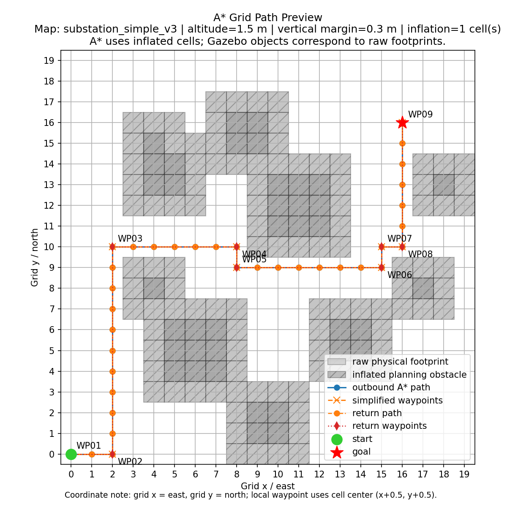

# Autonomous UAV Path Planning and Replanning

Simulation-first UAV autonomy project for substation inspection, built with
Python, PX4 SITL, Gazebo, MAVSDK, and grid-based A* planning.



[Demo video](https://github.com/Xieyizhou/uav-path-planning-demo/releases/tag/v0.1-demo)
· [Command reference](docs/CLI_REFERENCE.md)
· [Architecture](docs/architecture.md)
· [Experiment protocol](docs/EXPERIMENT_PROTOCOL.md)

## Project Snapshot

| Area | Implementation |
| --- | --- |
| Autonomous planning | Height-aware A* routing, obstacle inflation, path simplification, and return-route generation |
| Flight execution | MAVSDK local-NED waypoint control against PX4 SITL and Gazebo |
| Risk response | Simulated forward obstacle perception with `log_only`, `slow_down`, and `stop_and_land` actions |
| Local replanning | Candidate-only evaluation and active replacement of remaining outbound waypoints |
| Test environments | 5 coordinated Gazebo/A* maps, 5 safe destination presets per map, and map/target switching |
| Evaluation | Structured telemetry, run manifests, plots, stage summaries, and cross-stage comparisons |
| Reliability | Explicit failure codes, timeout-bounded runtime tasks, landing confirmation, PID-scoped cleanup, and parameter validation |
| Developer experience | One modular `main.py` command center and 62 offline regression tests |

## Selected Engineering Contributions

- Built an end-to-end autonomy pipeline from grid planning to simulated flight,
  telemetry collection, risk response, replanning, and experiment analysis.
- Kept the Gazebo world, PX4 spawn pose, A* obstacle grid, and selected
  destination synchronized through a validated map catalog.
- Designed five test environments ranging from a 16 × 16 m training yard to a
  dense 32 × 32 m multi-voltage station, with 25 validated destination presets.
- Added four reproducible experiment stages: static A*, perception response,
  log-only local replanning, and active route replacement.
- Hardened execution with connection, telemetry, waypoint, landing, and logger
  timeouts; atomic run-status records; confirmed landing state; and cleanup
  limited to project-managed processes.
- Refactored project execution into a small modular CLI while preserving
  advanced flight parameters and correct subprocess exit codes.

## Measured Simulation Results

The committed sample artifacts contain one selected landmark run from each
official stage:

| Stage | Flight time | Key result | Safety-buffer violations | Status |
| --- | ---: | --- | ---: | --- |
| Static A* | 149.132 s | Completed a 68 m planned round trip | 0 | PASS |
| Perception response | 177.210 s | 679 risk detections and 305 slow-down events | 0 | PASS |
| Replan log-only | 149.169 s | 4 successful candidates from 4 replan attempts | 0 | PASS |
| Active replan | 220.088 s | 3 successful replans and 1 active route replacement | 0 | PASS* |

Source data: [comparison summary](data/sample_outputs/comparison_summary.md) and
[selected run metadata](data/sample_outputs/selected_runs.json).

\* The legacy active-replan landmark proves route replacement, but its log also
contains a target-switching anomaly. The current code includes stricter
target-sequence validation; three new real simulation trials must pass before
claiming robust active-replan target switching.

## System Architecture

```text
Map + destination catalog
          ↓
Height-aware obstacle grid → A* global route → simplified waypoints
                                                ↓
Gazebo world ← PX4 SITL ← MAVSDK local-NED flight controller
                                                ↓
                            telemetry + simulated perception
                                                ↓
                      risk action / local route replacement
                                                ↓
                    CSV logs → metrics → plots → comparisons
```

The project separates user commands, flight execution, planning, perception,
map management, and reporting into small modules under `src/`.

## Technology Stack

- Python 3.11, `asyncio`, `unittest`
- PX4 SITL, Gazebo Sim, MAVSDK
- A* search and grid-based obstacle modeling
- pandas and Matplotlib for telemetry analysis
- Bash experiment launchers and GitHub Actions offline validation
- JSON/SDF configuration for synchronized planning and simulation maps

## Quick Start

Prerequisites: Python 3.9+, PX4 SITL/Gazebo, and a local
`~/PX4-Autopilot` checkout.

```bash
python3 -m venv .venv
source .venv/bin/activate
pip install -r requirements.txt
python main.py check environment
```

Select a map and destination:

```bash
python main.py map
python main.py point
```

Start PX4/Gazebo in terminal A:

```bash
python main.py map start
```

Preview or fly in terminal B:

```bash
source .venv/bin/activate
python main.py task run preview_route
python main.py task run fly_round_trip
```

Flight commands control PX4 SITL. Use the preview command first when testing a
new map or destination.

## Unified Command Center

```bash
python main.py --help

python main.py map list
python main.py point list
python main.py task list

python main.py astar preview --return-home
python main.py astar fly --return-home --max-speed 0.8

python main.py experiment run static
python main.py experiment run-all --trials 3

python main.py report summarize
python main.py report compare --mode both --min-runs-per-stage 3

python main.py check all
```

See [docs/CLI_REFERENCE.md](docs/CLI_REFERENCE.md) for every command and advanced
parameter-forwarding example.

## Repository Structure

| Path | Purpose |
| --- | --- |
| `main.py` | Unified user entry point |
| `src/cli/` | Modular command routing |
| `src/planner/` | A* search, obstacle conversion, and path simplification |
| `src/flight/` | MAVSDK flight runtime, task presets, and replanning orchestration |
| `src/perception/` | Simulated obstacle detector and risk-state logic |
| `src/maps/` | Map catalog, target selection, and Gazebo marker synchronization |
| `src/logging/` | Telemetry, metrics, plots, reports, and comparisons |
| `scripts/flight/experiments/` | Reproducible four-stage experiment launchers |
| `config/maps/` | Generated map-specific A* configurations |
| `simulation/worlds/` | Gazebo SDF test environments |
| `tests/` | Offline regression and safety tests |

## Verification

```bash
python main.py check perception
python main.py check replan
python main.py check maps
python main.py check tests
python main.py check all
```

The current suite contains 62 offline tests covering CLI routing, map/target
alignment, A* reachability, parameter safety, exit-code propagation, timeout
behavior, landing confirmation, task presets, goal-marker synchronization, and
active-replan validation. PX4/Gazebo flight validation remains a separate local
step and is not implied by a passing offline CI run.

## Scope and Limitations

- Simulation only; the system has not been validated on real UAV hardware.
- Perception is map-based and rule-based, not camera/LiDAR deep perception.
- Obstacles are static in the current portfolio demo.
- Active route replacement is a prototype and still requires repeated
  target-switching validation in full PX4/Gazebo trials.
- The committed results are selected demonstration runs, not a statistical
  performance claim.

## Resume-Ready Summary

- Engineered a PX4/Gazebo UAV autonomy pipeline integrating A* route planning,
  MAVSDK waypoint control, simulated perception, telemetry analysis, and local
  route replanning across five substation test environments.
- Developed a four-stage experimental framework with structured logs,
  reproducible reports, and safety-aware runtime controls; demonstrated 305
  perception-triggered slow-down events and active route replacement in
  simulation with zero recorded safety-buffer violations in selected runs.
- Improved maintainability and reliability through a unified modular CLI, 25
  validated target presets, bounded asynchronous cleanup, explicit failure
  propagation, and 62 automated offline tests.
